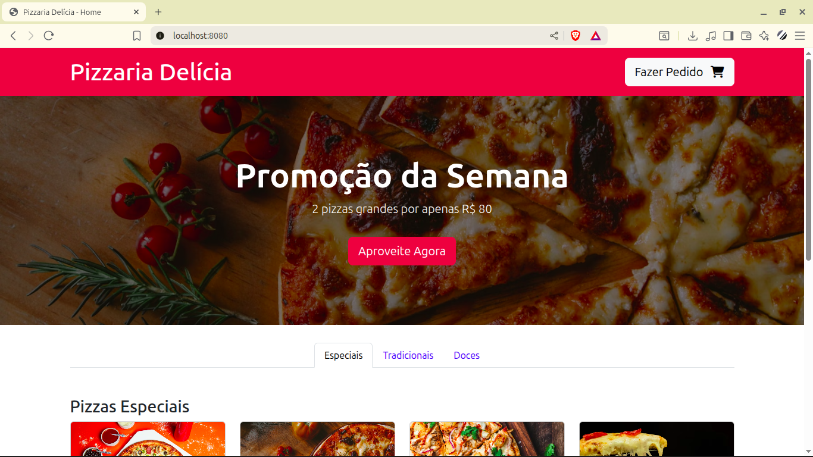
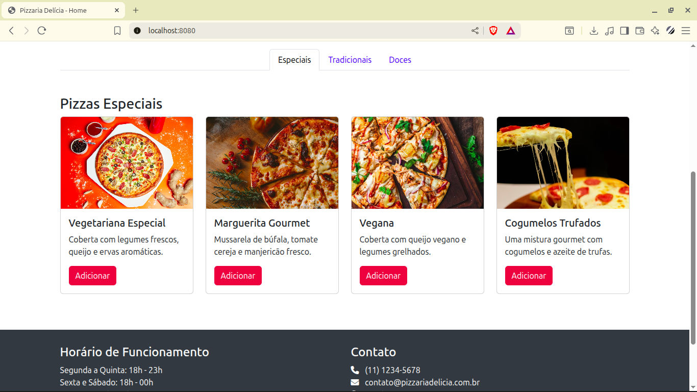
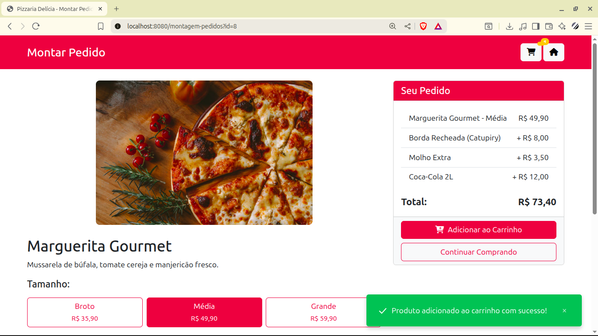
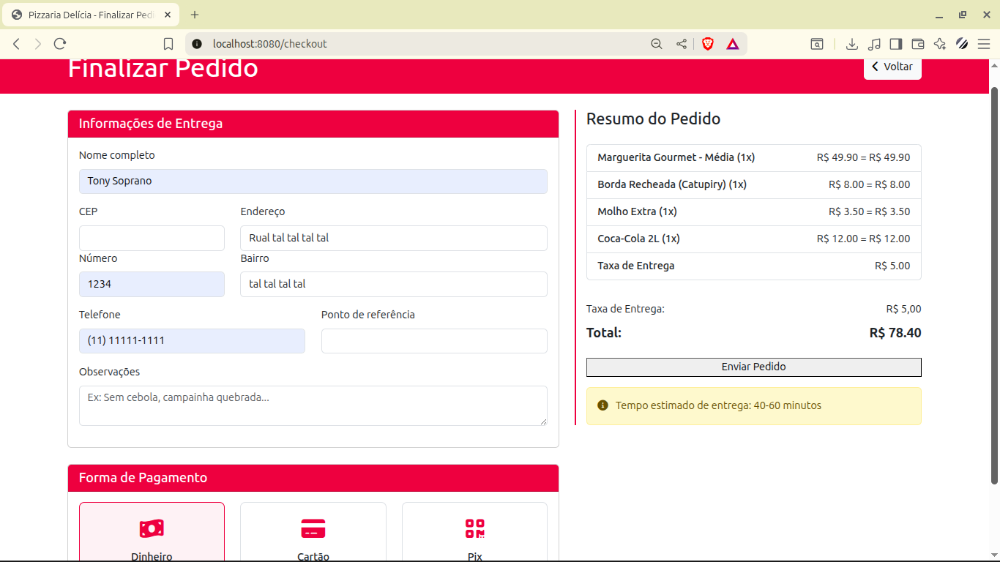
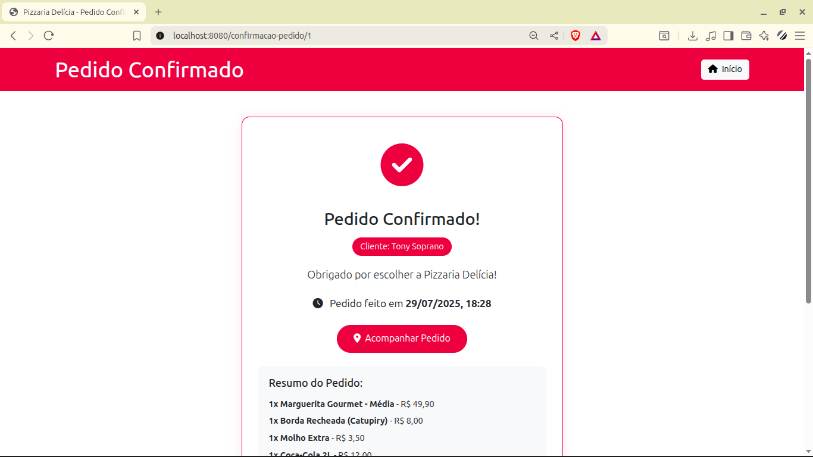
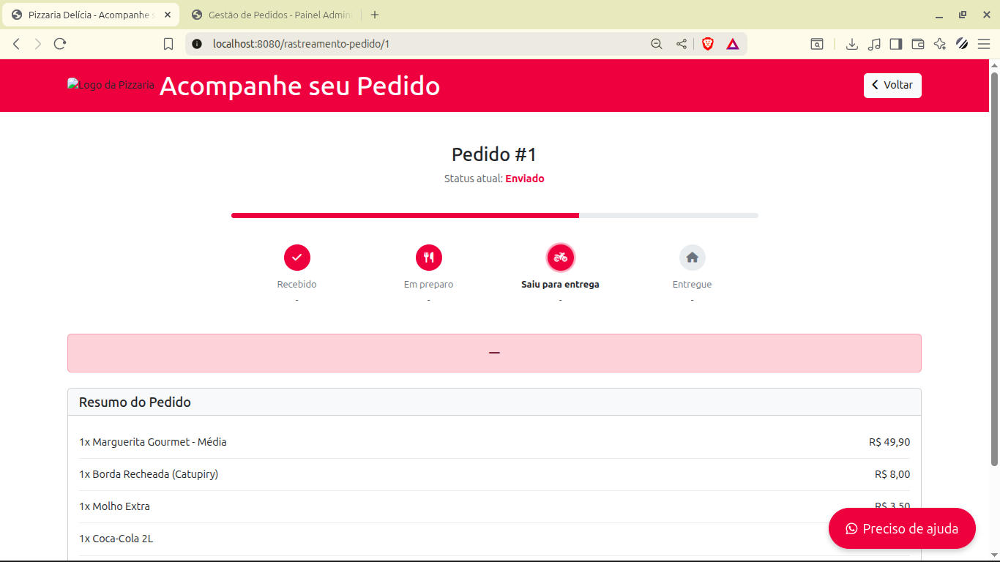
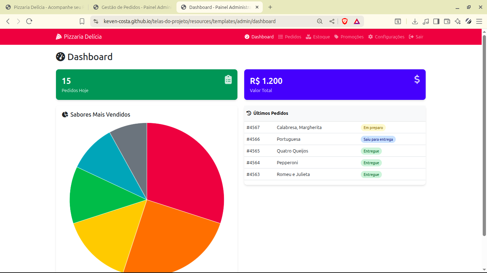

# Telas do projeto: Sistema de Gestão para Pizzaria 🍕
Este repositório contém apenas os arquivos estáticos do projeto para **visualização**. Algumas funcionalidades como botões e interações podem não funcionar corretamente aqui pois o projeto foi projetado para ser executado em um ambiente Docker banco de dados e etc.

### Link do projeto: https://github.com/Keven-Costa/sistema-de-gestao-para-pizzaria

## 📄 Páginas para Vizualição
**Click no link para ver cada página**

#### Cliente:
- [Home](https://keven-costa.github.io/telas-do-projeto/resources/static/index)

- [Montagem de Pedido](https://keven-costa.github.io/telas-do-projeto/resources/static/montagem-pedido)

- [Confirmação do Pedido](https://keven-costa.github.io/telas-do-projeto/resources/static/confimacao-pedido)

- [Checkout](https://keven-costa.github.io/telas-do-projeto/resources/static/checkout)

- [Rastreamento do Pedido](https://keven-costa.github.io/telas-do-projeto/resources/static/rastreamento-pedido)

#### Administração:

- [Dashboard](https://keven-costa.github.io/telas-do-projeto/resources/templates/admin/dashboard)

- [Login](https://keven-costa.github.io/telas-do-projeto/resources/templates/admin/login)

- [Gestão dos Ingredientes](https://keven-costa.github.io/telas-do-projeto/resources/templates/admin/gestao-ingredientes)

- [Gestão Pedidos](https://keven-costa.github.io/telas-do-projeto/resources/templates/admin/gestao-pedidos)

- [Painel de Promoções](https://keven-costa.github.io/telas-do-projeto/resources/templates/admin/painel-promocoes)

## 📷 Imagens

  
📌 Clique aqui para ver o texto oculto

  
  **Este é o conteúdo que será mostrado quando clicado!**  
  - Você pode usar *Markdown* aqui.  
  - Incluir listas, `códigos`, etc.  

